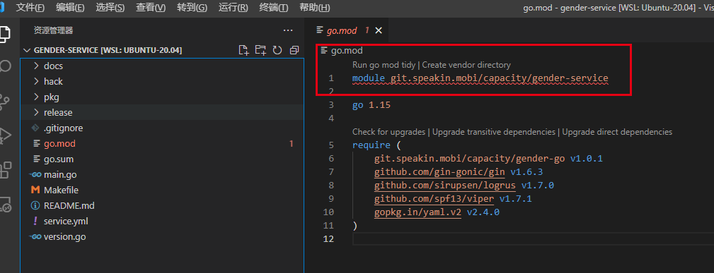

### 项目部署流程

- 配置go env 环境参数

  ```shell
  # 开启代理
  go env -w GO111MODULE=on
  go env -w GOPROXY=https://goproxy.cn,direct
  # 关闭代理
  go env -u GOPROXY
  
  # 配置私有仓库
  go env -w GOINSECURE=git.speakin.mobi
  go env -w GONOPROXY=git.speakin.mobi
  go env -w GONOSUMDB=git.speakin.mobi
  go env -w GOPRIVATE=git.speakin.mobi
  ```

  

- ssh生成公钥

  ```shell
  ssh-keygen -t rsa -C "邮箱地址"
  # 生成的公钥在~/.ssh/文件夹下
  ```

  

- 现将项目克隆到本机

  ```shell
  git clone git@git.speakin.mobi:capacity/gender-service.git
  ```

- 刚打开项目可能会遇到下面的问题

  

- 先配置git，然后执行一下 ```go mod tidy``` 

  ```shell
  git config --global url."git@git.speakin.mobi:".insteadOf "http://git.speakin.mobi/"
  ```


- 安装swag

  ```shell
  go get -u github.com/swaggo/swag/cmd/swag
  ```


- 配置到环境变量中

  ```shell
  vim ~/.bashrc
  # 在最后一行添加 
  export PATH=/home/wan/go/bin:$PATH
  # 添加完成之后执行
  source ~/.bashrc
  ```

  

- ```hack```文件夹中的shell脚本及其功能

  ```shell
  # 本文件主要用于下载和拷贝第三方动态链接库，头文件和引擎模型
  # ./hack/3rd.sh
  
  # 下载GPU链接库和头文件：sudo ./hack/3rd.sh ready library_gpu
  # 下载GPU模型：sudo ./hack/3rd.sh ready model_gpu
  
  # 具体可以参考3rd.sh文件中的注释
  ```

- 在根目录下编译程序

  ```shell
  make clean && make
  ```

- 编译完成后的文件在项目的根目录下的```dist```文件中

  ```shell
  # 运行项目
  ./dist/gender-service/gender-service   
  ```

  

